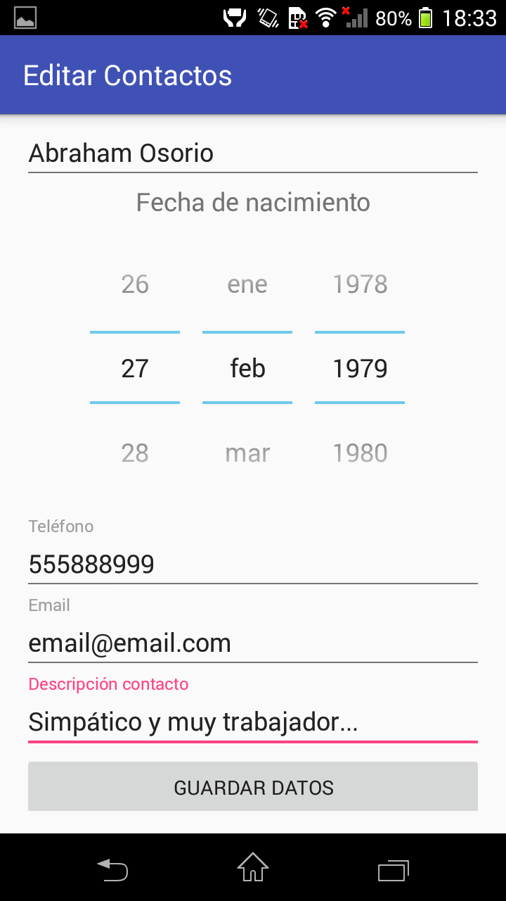
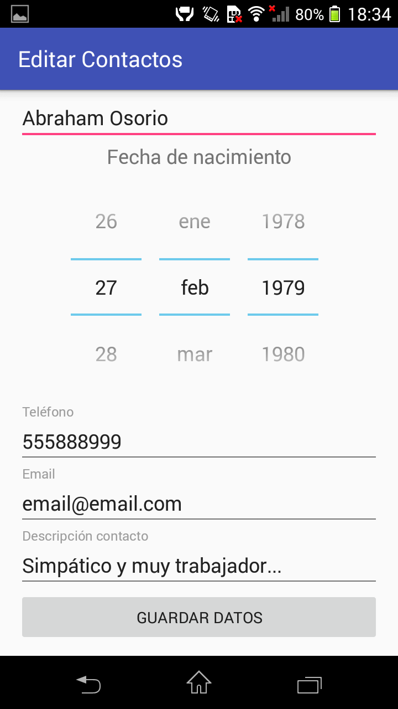

# EditarContactos

## Tarea semana 2

La activity 1 `MainActivity.java` presenta unos campos de formulario para que el usuario los rellene diseñados en el layout `activity_main.xml`.

Se rellenan los datos y pulsamos en "Guardar datos" para pasar esos datos a la activity 2 `DetalleContacto.java`

Y los presente en pantalla con el layout `activity_detalle_contacto.xml`

Pulsamos en "Editar datos" para enviar los datos a la activity 1 y poder cambiar lo que se desee.

